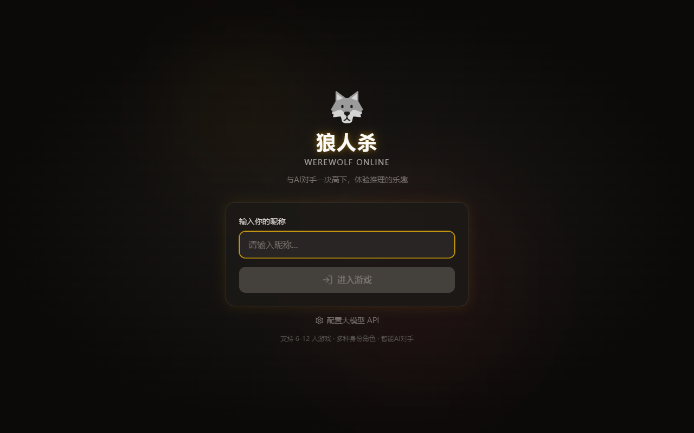
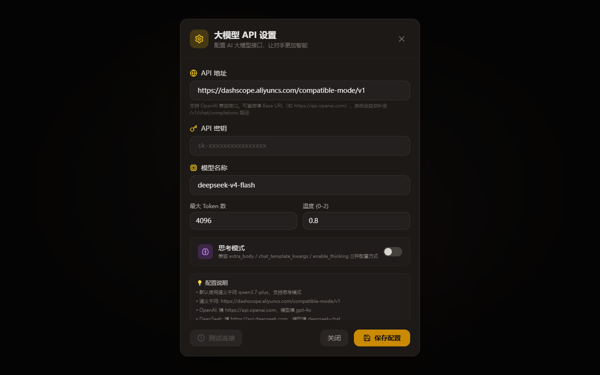

# 🐺 狼人杀 - AI 智能体对战

<p align="center">
  <b>一款基于大语言模型（LLM）驱动的单机狼人杀网页游戏</b>
</p>

<p align="center">
  你 vs 多个 AI 玩家 · 完整角色阵容 · 实时推理对战
</p>

<p align="center">
  <a href="https://www.dawndcy.online">🌐 在线体验</a>
  &nbsp;|&nbsp;
  <a href="https://github.com/dawn-dcy/werewolf-game">📦 GitHub 仓库</a>
</p>

---

## ✨ 特色

- 🧠 **真实 LLM 驱动 AI** — 每个 AI 玩家独立调用大语言模型，拥有独特的角色提示词和策略
- 🎭 **完整角色阵容** — 支持狼人、村民、预言家、女巫、猎人、守卫 6 种标准角色
- 🔒 **信息隔离设计** — AI 只知道自己"应该知道"的信息，保证游戏公平性
- 🔄 **完整游戏流程** — 夜晚/白天完整循环、平票处理、猎人开枪、MVP 评选
- 👁️ **上帝视角** — 随时查看所有玩家身份、夜晚行动、发言和投票记录
- 🔌 **灵活 API 配置** — 支持任意 OpenAI 兼容 API，含 DeepSeek 思考模式
- 📱 **无 API 也能玩** — 未配置 API 时自动使用随机策略降级运行

---

## 📖 游戏流程

### 第一步：配置大模型 API（必读）

> ⚠️ **首次使用请务必先配置 API！** 否则 AI 玩家将使用随机策略，游戏体验会大打折扣。

点击首页底部的 **「配置大模型 API」** 按钮，填入你的 API 信息：



**设置页面**中填写：

- **API 地址**：任意 OpenAI 兼容接口（默认百炼 dashscope）
- **API 密钥**：你的 API Key
- **模型名称**：如 `deepseek-v4-flash`、`gpt-4o`、`qwen-plus`
- 点击 **「测试连接」** 确认配置正确，再点击 **「保存配置」**



> 💡 支持 DeepSeek、通义千问、GPT、智谱 GLM 等任意兼容 OpenAI Chat Completions 格式的模型。

---

### 第二步：进入游戏

保存 API 配置后回到首页，输入你的昵称，点击 **「进入游戏」**：


---

### 第三步：选择游戏人数

根据自己的喜好选择 **6 - 12 人局**，系统会自动为所有 AI 玩家分配身份：


---

### 第四步：开始对战

游戏按照 **夜晚 → 白天 → 投票 → 下一轮** 的标准狼人杀流程进行。每轮 AI 玩家会：
- 🐺 狼人夜间投票刀人
- 🔮 预言家查验身份
- 🧪 女巫使用解药/毒药
- 🛡️ 守卫守护目标
- 💬 白天自由发言讨论
- 🗳️ 全体投票放逐


点击右上角 👁️ 按钮可随时查看**上帝视角**，了解所有玩家的身份和行动记录。

---

## 🎮 游戏角色

| 角色 | 阵营 | 技能 |
|------|------|------|
| 🐺 狼人 | 狼人阵营 | 每晚投票击杀一名玩家，互相知道队友 |
| 👤 村民 | 好人阵营 | 无特殊技能，靠推理和投票找出狼人 |
| 🔮 预言家 | 好人阵营 | 每晚查验一名玩家身份（狼人/好人） |
| 🧪 女巫 | 好人阵营 | 拥有一瓶解药和一瓶毒药，各只能用一次 |
| 🏹 猎人 | 好人阵营 | 死亡时开枪带走一名玩家 |
| 🛡️ 守卫 | 好人阵营 | 每晚守护一名玩家，不能连续守护同一人 |

### 角色分配

| 人数 | 狼人 | 村民 | 神职 |
|------|------|------|------|
| 6 人 | 2 | 2 | 预言家、女巫 |
| 7 人 | 2 | 3 | 预言家、女巫 |
| 8 人 | 2 | 3 | 预言家、女巫、猎人 |
| 9 人 | 3 | 3 | 预言家、女巫、猎人 |
| 10 人 | 3 | 4 | 预言家、女巫、猎人 |
| 11 人 | 3 | 4 | 预言家、女巫、猎人、守卫 |
| 12 人 | 4 | 4 | 预言家、女巫、猎人、守卫 |

**胜利条件**（屠边规则）：狼人杀光所有神职或所有村民即获胜；好人放逐所有狼人即获胜。

---

## 🚀 快速开始

### 环境要求

- Node.js 18+
- npm 或 pnpm

### 安装与运行

```bash
# 克隆项目
git clone https://github.com/dawn-dcy/werewolf-game.git
cd werewolf-game

# 安装依赖
npm install

# 启动开发服务器
npm run dev
```

浏览器打开 `http://localhost:5173` 即可开始游戏。

### 构建生产版本

```bash
npm run build
npm run preview
```

---

## ⚙️ AI 配置

进入游戏后，点击 **设置** 按钮配置大模型 API：

| 参数 | 说明 |
|------|------|
| API 地址 | OpenAI 兼容接口地址（默认：百炼 dashscope） |
| API 密钥 | 你的 API Key |
| 模型名称 | 模型 ID，如 `deepseek-v4-flash`、`gpt-4o` |
| Max Tokens | 单次回复最大 Token 数 |
| Temperature | 随机性参数 (0-2) |
| 思考模式 | 开启 DeepSeek 深度思考 |

支持任意兼容 OpenAI Chat Completions 格式的大模型服务。

---

## 🛠 技术栈

| 类别 | 技术 |
|------|------|
| 前端框架 | React 18 + TypeScript |
| 构建工具 | Vite 5 |
| 状态管理 | Zustand |
| 样式方案 | Tailwind CSS |
| 图标库 | Lucide React |
| 头像生成 | 本地 SVG 生成 |

---

## 📁 项目结构

```
werewolf-game/
├── src/
│   ├── components/     # UI 组件
│   │   ├── LoginPage.tsx       # 登录页面
│   │   ├── Lobby.tsx           # 大厅（选人数、看规则）
│   │   ├── RoleReveal.tsx      # 身份展示
│   │   ├── NightPhase.tsx      # 夜晚阶段
│   │   ├── DayPhase.tsx        # 白天讨论/投票
│   │   ├── GameOver.tsx        # 游戏结束 & MVP
│   │   ├── HunterShoot.tsx     # 猎人开枪
│   │   ├── SpectatorView.tsx   # 旁观视角
│   │   ├── GodView.tsx         # 上帝视角侧边栏
│   │   ├── AISettings.tsx      # AI 配置弹窗
│   │   ├── PlayerList.tsx      # 玩家列表
│   │   └── Avatar.tsx          # 头像组件
│   ├── services/
│   │   └── aiService.ts        # AI 核心：提示词构建、LLM 调用
│   ├── store/
│   │   └── gameStore.ts        # Zustand 全局状态 & 游戏逻辑
│   ├── utils/
│   │   └── gameLogic.ts        # 角色分配、胜利条件
│   ├── types/
│   │   └── game.ts             # TypeScript 类型定义
│   ├── App.tsx                 # 状态机路由
│   └── main.tsx                # 入口
└── package.json
```

---

## 🧠 AI 设计原理

### 信息隔离

每个 AI 玩家只获得与自身角色身份相符的信息：

- **狼人**：知道狼队友是谁，不知道好人具体身份
- **预言家**：知道自己的查验历史和结果
- **女巫**：解药用掉前知道刀口，用药后不再知道
- **守卫**：知道自己之前守护过谁
- **猎人**：知道开枪规则（夜晚无声/白天公开）
- **村民**：只知道公开信息，全靠推理

### 并行调用

所有 AI 狼人并行调用 LLM 投票决定刀口，得票最多者被击杀。其他神职也独立决策。

### 上下文管理

历史轮次自动生成摘要压缩，避免上下文超长导致 AI 表现下降。

---

## 📄 License

MIT
